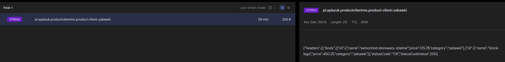

# Microservices-Spring-Cloud-Course

This course was created by Przemysław Bykowski an expert in Spring Boot and Microservices architecture.
The course content covers the following topics: Service Discovery, Centralized Configuration, 
Load Balancing, Asynchronous Communication, Distributed Tracing and Security with Keycloak
More details are given at: https://architektit.pl/ 

# Training Path
### MODULE 1: Introduction and Organizational Matters
### **Main Topics**:
1. Join the community
2. Effective learning
3. Toolkit

### MODULE 2: Philosophy of Microservices and Distributed Architecture
### **Main Topics**:
1. Microservices genesis
2. When we should not use microservices
3. Architecture patterns
4. Test

### MODULE 3: Configuration of the Configuration Server and Service Discovery Server
### **Main Topics**:
1. Service Registration and Discovery
2. Eureka Server
3. RestClient vs RestTemplate
4. Spring Cloud Config Server
5. Test 
6. Homework:
   * Description: Create a solution that will allow you to dynamically update the application configuration downloaded from the repository without rebuilding it.
   * Solution: 
     * [Link to ms](https://github.com/APlazuk/module3-homework/blob/b8d16684ec256a16b821a34b19b056de7467e2dc/ms1/src/main/java/pl/aplazuk/ms1/config/ConfigServerPropertiesUpdate.java)
     * [Link to spring cloud config server](https://github.com/APlazuk/spring-cloud-config-server)

### MODULE 4: Designing and Creating Complementary Services
### **Main Topics**:
1. Client-Side Load-Balancing
2. Server-Side Load Balancer
3. Adding DB to Microservice
4. Test
5. Homework:
    * Description: Model two microservices with two profiles each: prod, dev.
      Within the production profile connect to MySql DB.
      Within the development profile connect to a local database, e.g. H2, and have it populated with sample data.
    * Solution:
      * Dev Profile
        * [Link to ms](https://github.com/APlazuk/module4-homework/tree/dev/)
        * [Link to spring cloud config server](https://github.com/APlazuk/spring-cloud-config-server/tree/feature-modul4-dev)
      * Prod Profile
        * [Link to ms](https://github.com/APlazuk/module4-homework/tree/prod)
        * [Link to spring cloud config server](https://github.com/APlazuk/spring-cloud-config-server/tree/feature-modul4-prod)
### MODULE 5: Synchronous Communication
1. HTTP Client
2. Microservice Unit Tests
3. Microservice Integration Tests
4. Circuit Breaker
5. Homework:
    * Description: Development of a Microservice that connects to any service and a system that will store information on the client side and when something goes wrong this information is to be passed on to the user.
    * Solution:
        * [Link to ms](https://github.com/APlazuk/module4-homework/blob/e61848cc6dd219008c1c04a2ae3cc91a84c842a9/product-client-ms/src/main/java/pl/aplazuk/productclientms/ProductClient.java)

### MODULE 6: Asynchronous Communication with Apache Kafka
### **Main Topics**:
1. Apache Kafka --> Implementation based on prepared by Przemek project structure and key components
2. Kafdrop
3. Grafana
4. Homework:
    * Description: Create a new topic for the CPU and in ms3 listen to two different topics and aggregate the data so that it goes to the topic: alerts and data visualization in Grafana
    * Solution: (Based on module 6 implementation presented by Przemek)
        * [Link](https://github.com/APlazuk/kafka-cpu-ram-monitor)

### MODULE 7: Tracking and Monitoring Microservices with Zipkin
### MODULE 8: Microservices Security with Keycloak
